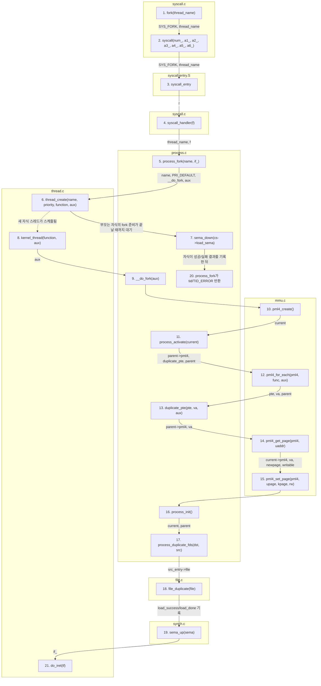

## `fork()` 함수의 흐름 (개요)

---

**큰 흐름**
1. 사용자 프로그램이 [pintos/lib/user/syscall.c](../../pintos/lib/user/syscall.c)의 `fork(thread_name)`을 호출합니다. 이 함수는 `SYS_FORK` 번호와 `thread_name`을 레지스터에 넣고 `syscall` 명령으로 커널에 진입합니다.

2. [pintos/userprog/syscall-entry.S](../../pintos/userprog/syscall-entry.S)가 사용자 레지스터들을 `struct intr_frame` 형태로 커널 스택에 저장한 뒤, 커널 쪽 [pintos/userprog/syscall.c](../../pintos/userprog/syscall.c)의 `syscall_handler(f)`를 호출합니다.

3. `syscall_handler(f)`는 `SYS_FORK` 분기에서 `thread_name`을 검증하고, [pintos/userprog/process.c](../../pintos/userprog/process.c)의 `process_fork(name, if_)`를 호출합니다. 부모에게 돌아갈 값은 `f->R.rax`에 저장됩니다.

4. `process_fork(name, if_)`는 부모의 실행 상태인 `intr_frame`을 `fork_aux`에 복사하고, `child_status`를 만들어 부모의 `children` 리스트에 연결합니다. 그 다음 [pintos/threads/thread.c](../../pintos/threads/thread.c)의 `thread_create(name, priority, function, aux)`로 자식 커널 스레드를 만듭니다.

5. `thread_create()` 이후 부모는 `sema_down(&cs->load_sema)`에서 기다립니다. 새 자식 스레드가 스케줄되면 `kernel_thread(function, aux)`가 실행되고, 결국 [pintos/userprog/process.c](../../pintos/userprog/process.c)의 `__do_fork(aux)`가 자식 쪽에서 실행됩니다.

6. `__do_fork(aux)`는 부모의 `intr_frame`을 자식 로컬 `if_`에 복사한 뒤 `if_.R.rax = 0`으로 바꿉니다. 그래서 같은 `fork()` 호출 이후에도 부모는 자식 tid를 받고, 자식은 `0`을 받습니다.

7. 주소 공간 복제는 두 갈래입니다. `VM`이 꺼진 Project 2 경로에서는 [pintos/threads/mmu.c](../../pintos/threads/mmu.c)의 `pml4_for_each(pml4, func, aux)`가 부모 페이지 테이블을 순회하고, 각 사용자 페이지마다 콜백 `duplicate_pte(pte, va, aux)`를 호출합니다. `duplicate_pte()`는 새 페이지를 할당해서 `memcpy` 후 자식 pml4에 매핑합니다. `VM`이 켜진 경우에는 `supplemental_page_table_copy(dst, src)` 경로를 탑니다.

8. 파일 디스크립터 복제는 [pintos/userprog/process.c](../../pintos/userprog/process.c)의 `process_duplicate_fds(dst, src)`가 담당합니다. 각 fd entry를 만들고 [pintos/filesys/file.c](../../pintos/filesys/file.c)의 `file_duplicate(file)`로 파일 위치와 deny-write 상태까지 복제합니다.

9. 자식은 메모리와 fd 복제를 시도한 뒤 성공/실패 결과를 `child_status`의 `load_success`, `load_done`에 기록하고 `sema_up(sema)`로 부모를 깨웁니다. 부모의 `process_fork()`는 그 전까지 `sema_down(sema)`에서 대기하므로, 깨어난 뒤 `load_success`를 확인해 자식 tid 또는 `TID_ERROR`를 반환합니다.

10. 자식은 성공한 경우 마지막에 [pintos/threads/thread.c](../../pintos/threads/thread.c)의 `do_iret(tf)`로 복사된 `intr_frame`을 복원하고 사용자 모드로 돌아갑니다. 이 지점부터 부모와 자식은 “같은 fork 이후 코드”를 서로 다른 반환값으로 실행합니다.

핵심은 `process_fork()`가 부모 쪽 준비와 동기화를 맡고, `__do_fork()`가 자식 쪽 실제 복제를 맡는 구조입니다. 부모는 `child tid`, 자식은 `0`을 받도록 `intr_frame`의 `R.rax`만 다르게 세팅하는 것이 fork 흐름의 중심입니다.
