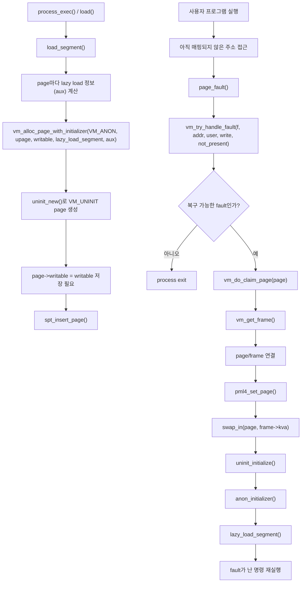
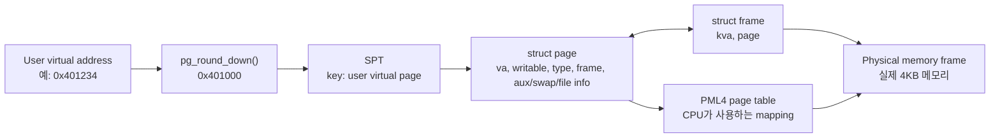
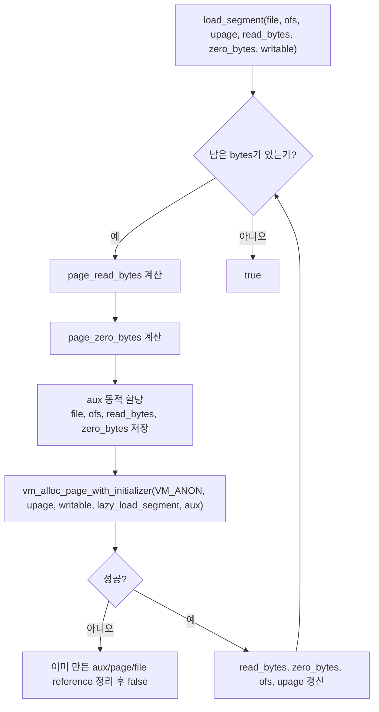
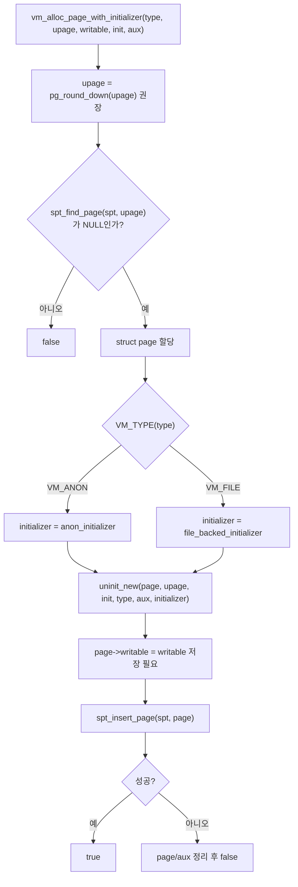
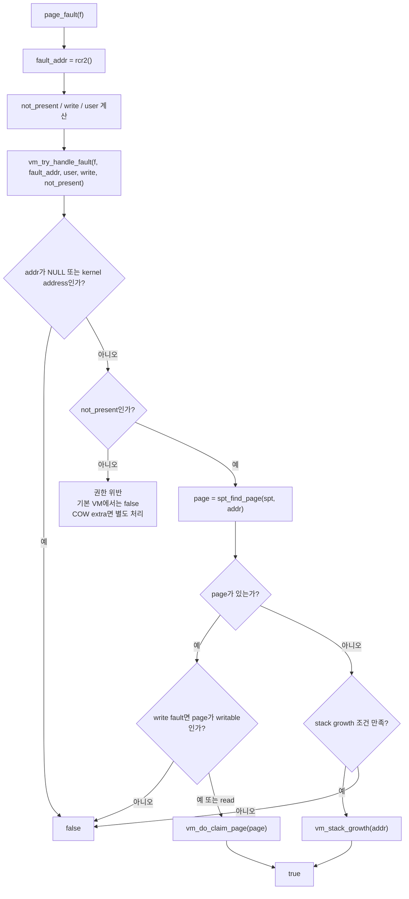
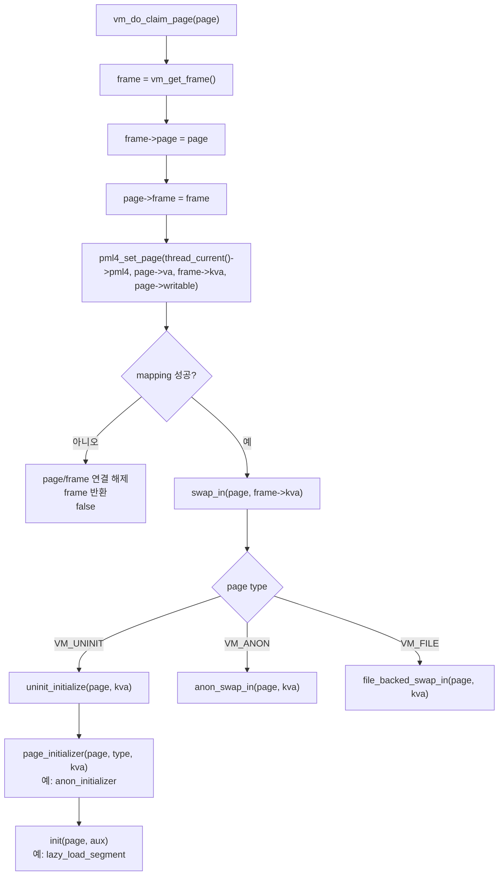
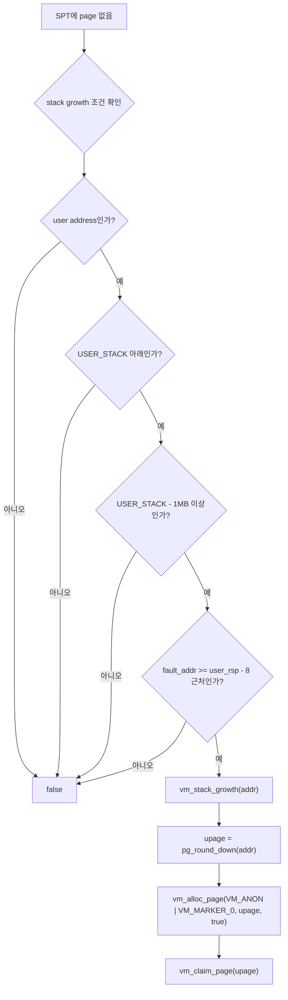

# Pintos VM 흐름 Mermaid 다이어그램

이 문서는 코치님이 공유한 VM 흐름 그림을 GitBook과 현재 코드 템플릿 기준으로 보정해 다시 정리한 자료다. 그림은 큰 방향을 이해하는 데 유용하지만, 실제 구현에서는 몇 가지 빠진 조건과 이름 차이를 반드시 보완해야 한다.

핵심은 다음 한 문장이다.

```text
SPT는 user virtual page의 설명서이고, page fault handler는 그 설명서를 보고 frame을 붙여 사용자 프로그램을 재개시킨다.
```

## 1. 전체 큰 흐름

Project 3의 중심 흐름은 "load 시점에는 설명서만 만들고, 접근 시점에 실제 frame을 붙인다"이다.



여기서 `VM_UNINIT`은 "아직 실제 page type으로 초기화되지 않았지만, 나중에 어떻게 만들지 알고 있는 page"다. 실행 파일 lazy page는 처음에는 파일에서 읽지만, 일반적으로 `VM_ANON`으로 등록해 이후 eviction 시 anonymous page처럼 swap disk를 사용한다.

## 2. 자료구조 관계

초심자는 `page`, `frame`, `pml4`, `SPT`를 분리해서 봐야 한다.



각 구조의 역할은 다음처럼 나누면 된다.

| 구조 | 역할 |
|------|------|
| SPT | page fault를 복구하기 위한 커널의 설명서 |
| `struct page` | user virtual page 하나의 상태와 type별 정보 |
| `struct frame` | 실제 물리 frame 하나와 그 frame을 쓰는 page |
| PML4 | CPU가 가상 주소를 물리 frame으로 바꾸기 위한 page table |

SPT와 PML4는 같은 것이 아니다. PML4는 지금 매핑된 주소 변환표이고, SPT는 아직 frame이 없는 lazy page나 swap out된 page까지 설명해야 한다.

## 3. Code loading: lazy page 등록

`load_segment()`는 실행 파일 segment를 page 단위로 나눈 뒤, 파일을 바로 읽지 않고 SPT에 `VM_UNINIT` page를 등록한다.



주의할 점은 `aux`다. `aux`에는 page fault 때 필요한 파일 정보가 들어가므로 `load_segment()`의 지역 변수 주소를 넘기면 안 된다. page마다 독립된 aux를 만들고, lazy load 성공 시 또는 uninit destroy 시 해제해야 한다.

## 4. `vm_alloc_page_with_initializer()` 내부 목표 흐름

현재 코드 템플릿은 TODO 상태다. 구현 후 목표는 다음 흐름이다.



GitBook과 현재 코드에서 `vm_alloc_page_with_initializer()`는 `type`에 맞는 page initializer를 골라 `uninit_new()`를 호출해야 한다. 단, 현재 `struct page`에는 `writable` 필드가 없으므로 구현하면서 직접 추가하거나 동등한 방식으로 writable 정보를 보관해야 한다.

## 5. Page fault 처리 흐름

page fault는 모두 같은 의미가 아니다. VM에서는 정상적으로 복구해야 하는 page fault가 있다.



중요한 점은 `not_present == true`인 write fault도 있을 수 있다는 것이다. 아직 매핑되지 않은 lazy page에 처음 쓰려고 하면 not-present fault가 날 수 있으므로, SPT에서 page를 찾은 뒤 `page->writable`을 확인해야 한다.

## 6. Frame claim과 lazy load 실행

`vm_do_claim_page()`는 SPT에 있던 page에 실제 frame을 붙이는 함수다.



`vm_get_frame()`은 단순히 `palloc_get_page(PAL_USER)`만 하는 함수가 아니다. 실제 구현에서는 보통 다음 일을 함께 한다.

```text
struct frame 할당
frame->kva = palloc_get_page(PAL_USER)
frame->page = NULL
frame table에 등록
frame 반환
```

초기 단계에서는 frame 부족 시 `PANIC("todo")`로 둘 수 있지만, eviction을 구현하려면 frame table에 user frame을 모두 등록해야 한다.

## 7. Stack growth 흐름

stack growth는 SPT에 page가 없을 때만 고려하는 예외 경로다. 아무 주소나 stack으로 인정하면 잘못된 포인터를 정상 접근처럼 복구하게 된다.



코치님 그림에서 `VM_MARKER`처럼 보이는 표기는 실제 코드 이름과 다르다. 현재 enum에는 `VM_MARKER_0`, `VM_MARKER_1`이 있다.

```c
vm_alloc_page (VM_ANON | VM_MARKER_0, upage, true);
```

marker는 선택 사항이다. marker 없이 주소 범위로 stack page를 판단할 수도 있지만, stack page를 명시적으로 표시하면 fork나 디버깅에서 의미가 더 분명해질 수 있다.

## 8. 이미지 자료와 실제 구현의 차이

코치님 이미지는 흐름을 잡는 데 유용하지만, 실제 작업 체크리스트로 사용할 때는 아래 차이를 보완해야 한다.

| 항목 | 이미지에서 보이는 흐름 | 실제 구현 시 보완 |
|------|------|------|
| writable | `writable` 인자가 전달됨 | `struct page`에 저장하고 write fault 때 검사해야 함 |
| frame | `palloc_get_page(PAL_USER)` 중심 | `struct frame` 할당, 초기화, frame table 등록 필요 |
| stack marker | `VM_MARKER`처럼 보임 | 실제 이름은 `VM_MARKER_0` 또는 `VM_MARKER_1` |
| stack address | `addr`로 page 생성처럼 보일 수 있음 | 반드시 `pg_round_down(addr)` 후 page 생성 |
| current code | 완성 흐름처럼 보임 | 현재 템플릿은 TODO가 많고, 그림은 구현 목표 흐름임 |
| not-present write fault | 권한 위반과 섞여 보일 수 있음 | SPT lookup 후 `page->writable` 검사 필요 |

## 9. 구현 전 확인 질문

아래 질문에 답할 수 있으면 이 다이어그램을 구현 순서로 바꿔도 된다.

1. `load_segment()`에서 파일을 바로 읽지 않고 SPT에 무엇을 등록하는가?
2. `VM_UNINIT` page가 첫 page fault에서 어떤 순서로 `VM_ANON` 또는 `VM_FILE`이 되는가?
3. `page->writable` 정보가 없으면 어떤 테스트가 위험해지는가?
4. `vm_get_frame()`이 `palloc_get_page(PAL_USER)` 외에 `struct frame`을 만들어야 하는 이유는 무엇인가?
5. stack growth에서 `addr`을 `pg_round_down()`하지 않으면 SPT key와 pml4 mapping에 어떤 문제가 생기는가?
6. eviction 후에도 SPT entry를 지우면 안 되는 이유는 무엇인가?
